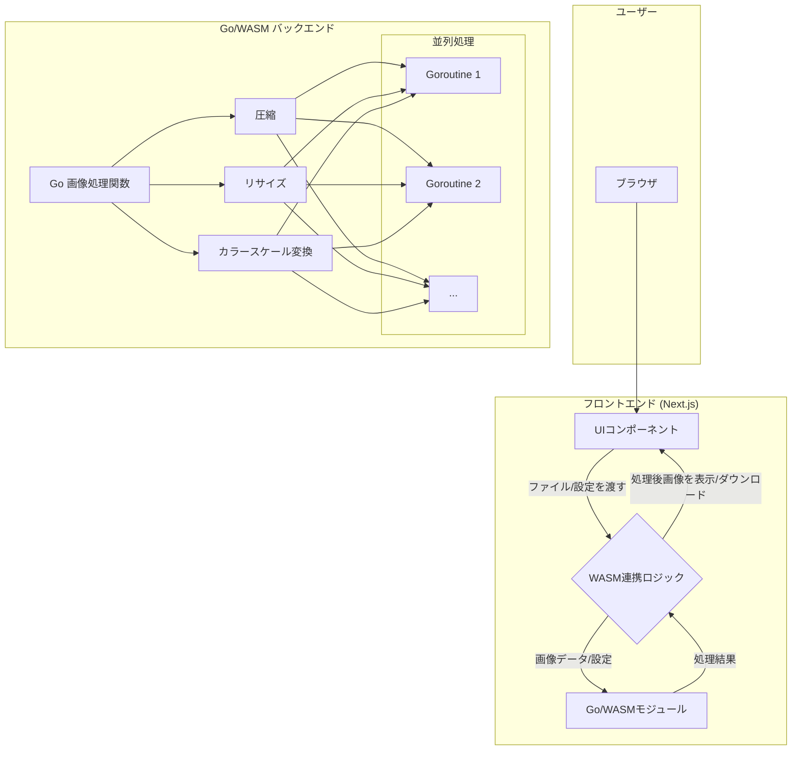

# プロジェクト設計図

## 概要

このプロジェクトは、Go言語で記述されたWebAssembly（WASM）モジュールを利用して、ブラウザ上で高速な画像処理（圧縮、リサイズ、カラースケール変更）を行うWebアプリケーションです。

## 技術スタック

-   **フロントエンド:** Next.js, TypeScript, Tailwind CSS
-   **画像処理:** Go, WebAssembly
-   **開発・実行環境:** Docker

## システムアーキテクチャ

以下にシステムの構成図を示します。

## 開発環境

Go言語によるWASM開発とNext.jsによるフロントエンド開発をスムーズに行うため、Dockerを利用して環境を構築します。

-   **Node.jsコンテナ:** Next.jsアプリケーションの実行環境
-   **Goコンテナ:** GoのソースコードをWASMにコンパイルするための環境

これにより、開発者ごとの環境差異をなくし、セットアップを容易にします。 